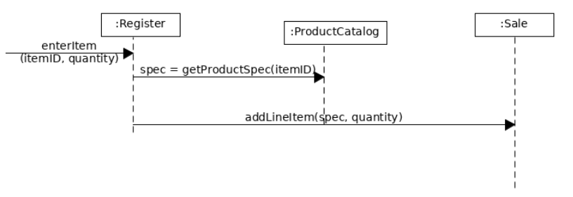

1、简答题
用简短的语言给出对分析、设计的理解。

    分析强调的是对问题和需求的调查研究，而不是解决方案。例如，如果需要一个新的在线交易系统，那么，该如何使用它，它应该具有哪些功能
    设计强调的是满足需求的的概念上的解决方案（在软件方面和硬件方面），而不是其实现，例如，对数据库方案和软件对象的描述

用一句话描述面向对象的分析与设计的优势。

它便于我们在软件中构建更真实的虚拟世界，迫使设计者在关注程序所需实现的功能的同时不至于忘记通过抽象去塑造概念
简述 UML（统一建模语言）的作用。考试考哪些图？

UML是描述，构造，和文档化系统制品的可视化语言，是图形化表示法的事实标准，用来绘制和展示软件相关的图形。
用例图，活动图，状态图
从软件本质的角度，解释软件范围（需求）控制的可行性

软件本身有复杂性，不可见性，不一致性，可变性等本质特点。造成了软件生产是易变，不可见，独特的智力生产。在多数情况下，客户与开发者能就项目的 20% 内容给出严格的需求约定，80% 的内容都是相对模糊的。因此最关键的是发现并满足客户感兴趣的内容是最关键的。砍去一些客户没思考清晰的业务，永远是对的。并且产品的设计者和开发者有更大的话语权，所以控制软件范围是可行的

2、项目管理实践

看板使用练习（提交看板执行结果贴图，建议使用 Git project）
使用截图工具（png格式输出），展现你团队的任务 Kanban
每个人的任务是明确的。必须一周后可以看到具体结果
每个人的任务是1-2项
至少包含一个团队活动任务

在这里插入图片描述

UML绘图工具练习（提交贴图，必须使用 UMLet）
请在 参考书2 或 教材 中选择一个类图（给出参考书页码图号）
教材p46 图6-1

